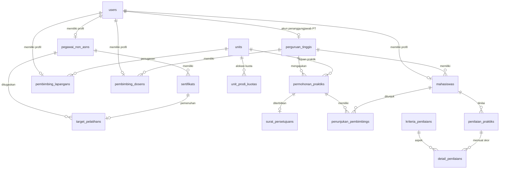

# Panduan Penggunaan & Struktur Sistem MANDALA

**MANDALA (Manajemen Diklat Akademik & Layanan Administrasi Rumah Sakit)**

Dokumen ini berisi panduan komprehensif mengenai struktur teknis kode, relasi basis data, logika bisnis, serta alur operasional aplikasi MANDALA berdasarkan peran (_Role-Based Access Control_).

---

## Daftar Isi

1. [Gambaran Umum Sistem](#1-gambaran-umum-sistem)
2. [Peta Struktur Direktori Proyek](#2-peta-struktur-direktori-proyek)
3. [Arsitektur Database & Model Data](#3-arsitektur-database--model-data)
4. [Logika Bisnis Kritis](#4-logika-bisnis-kritis)
   - [A. Validasi & Auto-Expiry MoU Perguruan Tinggi](#a-validasi--auto-expiry-mou-perguruan-tinggi)
   - [B. Pengecekan Kuota & Anti-Collision Overlap](#b-pengecekan-kuota--anti-collision-overlap)
   - [C. Otomatisasi Akun Admin Perguruan Tinggi](#c-otomatisasi-akun-admin-perguruan-tinggi)
   - [D. Alur Terintegrasi Review & Persetujuan Surat RS](#d-alur-terintegrasi-review--persetujuan-surat-rs)
   - [E. Manajemen Akun Mahasiswa Terisolasi per-PT](#e-manajemen-akun-mahasiswa-terisolasi-per-pt)
5. [Panduan Alur Penggunaan Berdasarkan Peran](#5-panduan-alur-penggunaan-berdasarkan-peran)
   - [A. Super Administrator](#a-super-administrator)
   - [B. Administrator Diklat RS](#b-administrator-diklat-rs)
   - [C. Admin Perguruan Tinggi Mitra](#c-admin-perguruan-tinggi-mitra)
   - [D. Peserta Diklat / Pegawai Non-ASN](#d-peserta-diklat--pegawai-non-asn)
   - [E. Pembimbing Lapangan (CI RS) & Pembimbing Dosen (PT)](#e-pembimbing-lapangan-ci-rs--pembimbing-dosen-pt)
   - [F. Mahasiswa Praktikan](#f-mahasiswa-praktikan)
6. [Daftar Endpoint Rute & Otorisasi RBAC](#6-daftar-endpoint-rute--otorisasi-rbac)
7. [Akun Uji Coba Default (Seeder)](#7-akun-uji-coba-default-seeder)

---

## 1. Gambaran Umum Sistem

MANDALA adalah sistem terpadu yang dirancang untuk mendukung operasional divisi **Pendidikan dan Pelatihan (Diklat)** serta **Pendidikan dan Penelitian (Diklit)** di lingkungan rumah sakit:

- **Modul Diklat:** Memastikan pemenuhan target kompetensi wajib dan fungsional bagi seluruh tenaga kesehatan dan staf pegawai/peserta diklat melalui penugasan target tahunan, pengunggahan berkas sertifikat, dan verifikasi administratif.
- **Modul Diklit:** Mengotomatisasi proses penerimaan mahasiswa praktik klinik dari perguruan tinggi mitra melalui pengecekan kuota unit secara _real-time_, validasi masa berlaku nota kesepahaman (MoU), penerbitan nomor surat izin resmi rumah sakit terintegrasi, penunjukan pembimbing, hingga evaluasi nilai kompetensi klinis terbobot.
- **Modul Manajemen Pengguna & RBAC:** Pengelolaan izin granular berbasis _Spatie Laravel Permission_, pendelegasian pengelolaan akun mahasiswa kepada Admin PT masing-masing, serta manajemen role penuh oleh Super Admin.

---

## 2. Peta Struktur Direktori Proyek

```plaintext
mandala/
├── app/
│   ├── Http/
│   │   ├── Controllers/
│   │   │   └── SsoController.php            # Autentikasi OIDC & SSO Ticket Handoff
│   │   └── Middleware/
│   │       └── CheckRole.php                # Middleware proteksi rute berbasis peran (RBAC)
│   ├── Models/                              # Model Eloquent
│   │   ├── User.php                         # Entitas akun utama + otentikasi
│   │   ├── PegawaiNonAsn.php                # Profil data pegawai / peserta diklat
│   │   ├── PerguruanTinggi.php              # Data PT mitra, masa berlaku MoU, & relasi ke User (Admin PT)
│   │   ├── Unit.php                         # Unit/Instalasi RS & mode kuota (per_prodi / gabungan)
│   │   ├── UnitProdiKuota.php               # Alokasi kuota spesifik per-prodi
│   │   ├── Mahasiswa.php                    # Data mahasiswa praktikan
│   │   ├── PembimbingLapangan.php           # Profil CI Lapangan RS
│   │   ├── PembimbingDosen.php              # Profil Dosen Pembimbing PT
│   │   ├── Sertifikat.php                   # Dokumen sertifikat pelatihan
│   │   ├── TargetPelatihan.php              # Target pemenuhan kompetensi
│   │   ├── PermohonanPraktik.php            # Pengajuan izin praktik RS
│   │   ├── SuratPersetujuan.php             # Surat persetujuan izin resmi RS
│   │   ├── PenunjukanPembimbing.php         # Penugasan CI & Dosen pembimbing
│   │   ├── KriteriaPenilaian.php            # Aspek evaluasi kompetensi klinis
│   │   ├── PenilaianPraktik.php             # Header penilaian mahasiswa
│   │   └── DetailPenilaian.php              # Rincian skor per kriteria
│   └── Services/
│       └── BookingKuotaService.php          # Service kalkulasi kuota overlap & validasi MoU
├── database/
│   ├── migrations/                          # Skema tabel database MySQL
│   └── seeders/
│       └── DiklatRsSeeder.php               # Seeder data pengujian komprehensif
├── public/
│   ├── favicon.svg                          # Favicon resmi vektor
│   ├── mandala.svg                          # Logo vektor resmi sistem MANDALA
│   └── ...
├── resources/
│   └── views/
│       ├── components/
│       │   ├── app-logo.blade.php           # Komponen wrapper logo sidebar & header
│       │   └── app-logo-icon.blade.php      # Komponen ikon SVG mandala.svg
│       ├── layouts/
│       │   └── app/
│       │       └── sidebar.blade.php        # Layout navigasi sidebar & header
│       ├── pages/                           # Komponen Livewire 4 Single-File Components
│       │   ├── diklat/
│       │   │   ├── ⚡target/                 # Modul target pelatihan pegawai
│       │   │   ├── ⚡sertifikat/             # Modul unggah sertifikat mandiri
│       │   │   └── ⚡verifikasi/             # Modul verifikasi admin diklat
│       │   ├── diklit/
│       │   │   ├── ⚡perguruan-tinggi/       # Modul master PT & MoU (auto user admin_pt)
│       │   │   ├── ⚡unit/                   # Modul unit RS & batas kuota
│       │   │   ├── ⚡booking/                # Modul kalender, booking & modal persetujuan surat terpadu
│       │   │   ├── ⚡pembimbing/             # Modul penunjukan pembimbing
│       │   │   ├── ⚡penilaian/              # Modul pengisian nilai kompetensi
│       │   │   └── ⚡kriteria/               # Modul master kriteria evaluasi
│       │   └── pengguna/
│       │       ├── ⚡user/                   # Manajemen akun (Super Admin, Admin Diklat, Admin PT)
│       │       └── ⚡role/                   # Manajemen Role & Permission Spatie (Super Admin)
│       ├── dashboard.blade.php              # Halaman dashboard metrik terpusat
│       └── landing.blade.php                # Landing page selamat datang
└── routes/
    ├── web.php                              # Rute antarmuka pengguna & proteksi RBAC
    ├── api.php                              # Rute REST API
    └── settings.php                         # Rute profil akun & keamanan (Passkeys/2FA)
```

---

## 3. Arsitektur Database & Model Data



---

## 4. Logika Bisnis Kritis

### A. Validasi & Auto-Expiry MoU Perguruan Tinggi

- Setiap institusi mitra memiliki masa berlaku MoU (`tanggal_mulai_mou` s/d `tanggal_selesai_mou`).
- Sistem secara reaktif mengevaluasi keaktifan MoU melalui accessor `is_mou_expired`. Jika tanggal selesai MoU telah lewat dari hari ini, sistem otomatis memperbarui `status_mou = false` (Nonaktif/Kedaluwarsa).
- Institusi dengan status MoU nonaktif atau kedaluwarsa secara otomatis diblokir dari pengajuan booking praktik baru di `BookingKuotaService`.

### B. Pengecekan Kuota & Anti-Collision Overlap

- Menggunakan formula rentang tanggal bersinggungan:
  $$\text{Overlap} \iff (\text{TglMulai}_A \le \text{TglSelesai}_B) \land (\text{TglSelesai}_A \ge \text{TglMulai}_B)$$
- Mendukung 2 mode kuota:
  1. `per_prodi`: Menghitung kuota mahasiswa yang teralokasi khusus untuk program studi tersebut.
  2. `gabungan`: Menghitung total mahasiswa dari seluruh prodi yang berada pada unit tersebut pada rentang waktu yang sama.
- Eksekusi kalkulasi dilakukan di dalam `DB::transaction()` dengan _pessimistic locking_ untuk mencegah _race condition_.

### C. Otomatisasi Akun Admin Perguruan Tinggi

- Saat Admin Diklat RS menambahkan Perguruan Tinggi baru di menu `/diklit/perguruan-tinggi`, sistem secara otomatis membuat akun login dengan peran `admin_pt`:
  - **Nama:** `Admin [Nama Perguruan Tinggi]`
  - **Email:** `[slug_nama_pt]@mandala.test` (contoh: `universitas-indonesia@mandala.test`)
  - **Kata Sandi:** `password`
  - Akun tersebut langsung terhubung ke relasi `perguruan_tinggis.user_id`.

### D. Alur Terintegrasi Review & Persetujuan Surat RS

- Alur persetujuan permohonan booking praktik dipusatkan langsung di dalam modal detail permohonan pada menu `/diklit/booking`:
  - **Tombol Setujui & Terbitkan Surat:** Membuka form input nomor surat izin RS dan catatan resmi.
  - **Tombol Tolak Permohonan:** Membuka form input alasan penolakan.
  - Menu terpisah "Persetujuan & Surat" dihilangkan dari navigasi dan dialihkan otomatis (301 redirect) ke `/diklit/booking`.

### E. Manajemen Akun Mahasiswa Terisolasi per-PT

- Melalui izin Spatie `kelola-akun-mahasiswa`, Admin PT dapat membuka menu `/pengguna/user`:
  - Hanya dapat melihat dan mengelola akun mahasiswa yang terdaftar di bawah perguruan tingginya.
  - Form penambahan dan pengeditan pengguna otomatis terkunci ke peran `mahasiswa` dan `perguruan_tinggi_id` milik institusi tersebut.
  - Admin PT tidak dapat melihat, mengubah, atau membuat akun staf rumah sakit, CI, maupun admin institusi lain.

---

## 5. Panduan Alur Penggunaan Berdasarkan Peran

### A. Super Administrator

1. Login menggunakan `superadmin@mandala.test`.
2. Buka menu **Manajemen Role & Permissions (`/pengguna/role`)** untuk mengelola izin Spatie, menambah peran baru, atau mengklik tombol **Terapkan Template Preset**.
3. Buka menu **Kelola Pengguna (`/pengguna/user`)** untuk mengelola seluruh akun pengguna di sistem.

### B. Administrator Diklat RS

1. Login menggunakan `admin@mandala.test`.
2. **Kelola MoU:** Buka `/diklit/perguruan-tinggi` untuk menambah institusi mitra (akun Admin PT otomatis dibuat).
3. **Atur Unit & Kuota:** Buka `/diklit/unit` untuk menentukan kapasitas ruangan dan mode kuota.
4. **Review Booking:** Buka `/diklit/booking`, klik baris permohonan untuk melihat detail, lalu klik tombol **Setujui & Terbitkan Surat** atau **Tolak**.
5. **Penunjukan Pembimbing:** Buka `/diklit/pembimbing` untuk menugaskan CI Lapangan dan Dosen Pembimbing.
6. **Kriteria & Penilaian:** Buka `/diklit/kriteria` untuk mengelola bobot penilaian kompetensi.
7. **Diklat Pegawai:** Buka `/diklat/target` untuk menetapkan target pelatihan pegawai dan `/diklat/verifikasi` untuk memeriksa sertifikat.

### C. Admin Perguruan Tinggi Mitra

1. Login menggunakan akun PT (misal: `adminpt@mandala.test`).
2. **Kelola Mahasiswa:** Buka `/pengguna/user` untuk mendaftarkan akun mahasiswa praktikan dari perguruan tingginya.
3. **Cek Kuota & Ajukan Booking:** Buka `/diklit/booking`, beralih ke tab **Kalender Keterisian** untuk memantau sisa kuota, lalu klik **Ajukan Permohonan Praktik**.
4. **Pantau Status:** Cek status permohonan (`diajukan`, `disetujui`, `ditolak`) dan unduh nomor surat persetujuan jika telah disetujui.

### D. Peserta Diklat / Pegawai Non-ASN

1. Login menggunakan akun pegawai (misal: `andika@mandala.test`).
2. Buka `/diklat/target` untuk melihat target pelatihan yang harus dipenuhi pada tahun berjalan.
3. Buka `/diklat/sertifikat` untuk mengunggah berkas PDF sertifikat pelatihan yang telah diikuti dan pantau status verifikasinya.

### E. Pembimbing Lapangan (CI RS) & Pembimbing Dosen (PT)

1. Login menggunakan akun pembimbing (misal: `ci.lapangan@mandala.test` atau `dosen@mandala.test`).
2. Buka menu **Penilaian Praktik (`/diklit/penilaian`)**.
3. Pilih mahasiswa bimbingan yang aktif, isi skor evaluasi per kriteria kompetensi (0–100), dan simpan nilai akhir.

### F. Mahasiswa Praktikan

1. Login menggunakan akun mahasiswa (misal: `mahasiswa@mandala.test`).
2. Akses dashboard untuk memantau unit stase praktik, jadwal tanggal stase, pembimbing lapangan/dosen yang ditugaskan, dan riwayat nilai evaluasi klinis.

---

## 6. Daftar Endpoint Rute & Otorisasi RBAC

| Rute URL                   | Nama Rute                 | Middleware / Permission                 | Deskripsi Halaman                           |
| :------------------------- | :------------------------ | :-------------------------------------- | :------------------------------------------ |
| `/`                        | `landing`                 | Public                                  | Landing page profil sistem MANDALA          |
| `/dashboard`               | `dashboard`               | `auth`                                  | Dashboard metrik terpusat sesuai peran      |
| `/diklat/target`           | `diklat.target`           | `kelola-target-pelatihan`               | Target pelatihan tahunan pegawai            |
| `/diklat/sertifikat`       | `diklat.sertifikat`       | `upload-sertifikat`                     | Unggah & riwayat berkas sertifikat          |
| `/diklat/verifikasi`       | `diklat.verifikasi`       | `verifikasi-sertifikat`                 | Audit & approval sertifikat pegawai         |
| `/diklit/perguruan-tinggi` | `diklit.perguruan-tinggi` | `kelola-pt-mou`                         | Master Perguruan Tinggi & MoU               |
| `/diklit/unit`             | `diklit.unit`             | `kelola-unit-rs`                        | Master Unit RS & Konfigurasi Kuota          |
| `/diklit/booking`          | `diklit.booking`          | `ajukan-booking-praktik`                | Kalender kuota, booking & persetujuan surat |
| `/diklit/persetujuan`      | `diklit.persetujuan`      | Redirect 301                            | Dialihkan ke `/diklit/booking`              |
| `/diklit/pembimbing`       | `diklit.pembimbing`       | `penunjukan-pembimbing`                 | Penunjukan CI RS & Dosen PT                 |
| `/diklit/kriteria`         | `diklit.kriteria`         | `kelola-kriteria-nilai`                 | Master kriteria & bobot penilaian           |
| `/diklit/penilaian`        | `diklit.penilaian`        | `input-penilaian-praktik`               | Evaluasi skor kompetensi klinis             |
| `/pengguna/user`           | `pengguna.user`           | `kelola-user` / `kelola-akun-mahasiswa` | Manajemen akun (Global / Khusus PT)         |
| `/pengguna/role`           | `pengguna.role`           | `super_admin` (`kelola-role`)           | Matriks Role & Permissions Spatie           |

---

## 7. Akun Uji Coba Default (Seeder)

Semua akun uji coba menggunakan kata sandi default: `password`

| Role                            | Email Login                | Hak Akses Utama                                             |
| :------------------------------ | :------------------------- | :---------------------------------------------------------- |
| **Super Administrator**         | `superadmin@mandala.test`  | Akses penuh & Kelola Role Spatie (`/pengguna/role`)         |
| **Admin Diklat RS**             | `admin@mandala.test`       | Kelola Diklat, Verifikasi, Persetujuan Booking, Kelola Akun |
| **Admin Perguruan Tinggi**      | `adminpt@mandala.test`     | Cek Kuota, Ajukan Booking Praktik, Kelola Akun Mahasiswa PT |
| **Peserta Diklat 1 (Dokter)**   | `andika@mandala.test`      | Target Pelatihan & Upload Sertifikat ACLS                   |
| **Peserta Diklat 2 (Farmasi)**  | `siti@mandala.test`        | Target Pelatihan & Upload Sertifikat Farmasi                |
| **Pembimbing Lapangan (CI RS)** | `ci.lapangan@mandala.test` | Input Penilaian Praktik Lapangan RS                         |
| **Pembimbing Dosen (PT)**       | `dosen@mandala.test`       | Input Penilaian Akademik Mahasiswa                          |
| **Mahasiswa Praktikan**         | `mahasiswa@mandala.test`   | Pantau Jadwal Stase, Pembimbing & Nilai Kompetensi          |
