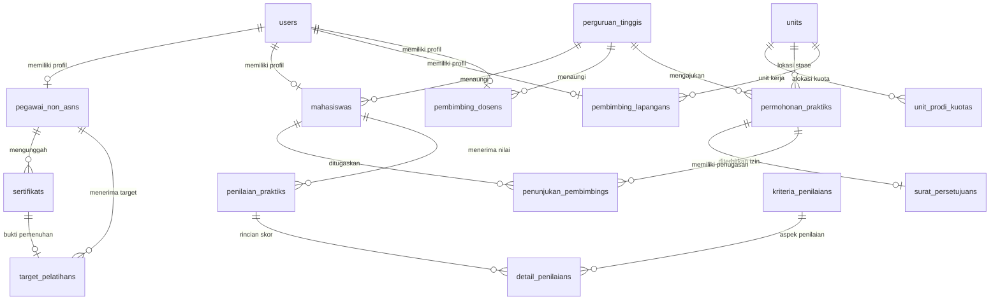

# Panduan Penggunaan & Struktur Sistem MANDALA
**MANDALA (Manajemen Diklat Akademik & Layanan Administrasi Rumah Sakit)**

Dokumen ini berisi panduan komprehensif mengenai struktur teknis kode, relasi basis data, serta alur penggunaan aplikasi MANDALA berdasarkan peran (*Role-Based Access Control*).

---

## Daftar Isi
1. [Gambaran Umum Sistem](#1-gambaran-umum-sistem)
2. [Peta Struktur Direktori Proyek](#2-peta-struktur-direktori-proyek)
3. [Arsitektur Database & Model Data](#3-arsitektur-database--model-data)
4. [Logika Bisnis Kritis (Pengecekan Kuota & MoU)](#4-logika-bisnis-kritis-pengecekan-kuota--mou)
5. [Panduan Penggunaan Berdasarkan Peran](#5-panduan-penggunaan-berdasarkan-peran)
   - [A. Administrator Diklat RS](#a-administrator-diklat-rs)
   - [B. Admin Perguruan Tinggi Mitra](#b-admin-perguruan-tinggi-mitra)
   - [C. peserta diklat](#c-pegawai-non-asn)
   - [D. Pembimbing Lapangan (CI RS) & Pembimbing Dosen (PT)](#d-pembimbing-lapangan-ci-rs--pembimbing-dosen-pt)
   - [E. Mahasiswa Praktikan](#e-mahasiswa-praktikan)
6. [Daftar Endpoint & Rute Navigasi](#6-daftar-endpoint--rute-navigasi)
7. [Akun Uji Coba Default](#7-akun-uji-coba-default)

---

## 1. Gambaran Umum Sistem

MANDALA adalah sistem terpadu yang dirancang untuk mendukung operasional divisi **Pendidikan dan Pelatihan (Diklat)** serta **Pendidikan dan Penelitian (Diklit)** di lingkungan rumah sakit:
- **Modul Diklat:** Bertujuan memastikan pemenuhan target kompetensi wajib dan fungsional bagi seluruh tenaga kesehatan dan peserta diklat melalui sistem penugasan target, pengunggahan sertifikat, dan verifikasi administratif.
- **Modul Diklit:** Mengotomatisasi proses penerimaan mahasiswa praktik klinik dari perguruan tinggi mitra melalui pengecekan kuota unit secara real-time, validasi masa berlaku nota kesepahaman (MoU), penerbitan surat izin praktik, penunjukan pembimbing, hingga evaluasi nilai kompetensi terbobot.

---

## 2. Peta Struktur Direktori Proyek

```plaintext
mandala/
├── app/
│   ├── Http/
│   │   ├── Controllers/
│   │   │   └── SsoController.php            # Autentikasi OIDC & SSO Ticket Handoff
│   │   └── Middleware/
│   │       └── CheckRole.php                # Middleware proteksi rute berbasis peran (RBAC)
│   ├── Models/                              # Model Eloquent
│   │   ├── User.php                         # Entitas akun utama + otentikasi
│   │   ├── PegawaiNonAsn.php                # Profil data peserta diklat
│   │   ├── PerguruanTinggi.php              # Data PT mitra & status MoU
│   │   ├── Unit.php                         # Unit/Instalasi RS & mode kuota
│   │   ├── UnitProdiKuota.php               # Alokasi kuota per-prodi
│   │   ├── Mahasiswa.php                    # Data mahasiswa praktikan
│   │   ├── PembimbingLapangan.php           # Profil CI Lapangan RS
│   │   ├── PembimbingDosen.php              # Profil Dosen Pembimbing PT
│   │   ├── Sertifikat.php                   # Dokumen sertifikat pelatihan
│   │   ├── TargetPelatihan.php              # Target pemenuhan kompetensi
│   │   ├── PermohonanPraktik.php            # Pengajuan izin praktik RS
│   │   ├── SuratPersetujuan.php             # Surat persetujuan izin resmi RS
│   │   ├── PenunjukanPembimbing.php         # Penugasan CI & Dosen pembimbing
│   │   ├── KriteriaPenilaian.php            # Aspek evaluasi kompetensi klinis
│   │   ├── PenilaianPraktik.php             # Header penilaian mahasiswa
│   │   └── DetailPenilaian.php              # Rincian skor per kriteria
│   └── Services/
│       └── BookingKuotaService.php          # Service kalkulasi kuota overlap & validasi MoU
├── database/
│   ├── migrations/                          # Skema tabel database
│   └── seeders/
│       └── DiklatRsSeeder.php               # Seeder data uji coba komprehensif
├── resources/
│   └── views/
│       ├── layouts/
│       │   └── app/
│       │       └── sidebar.blade.php        # Layout navigasi sidebar & header
│       ├── pages/                           # Komponen Livewire 4 SFC
│       │   ├── diklat/
│       │   │   ├── target/                  # Modul target pelatihan pegawai
│       │   │   ├── sertifikat/              # Modul unggah sertifikat mandiri
│       │   │   └── verifikasi/              # Modul verifikasi admin diklat
│       │   └── diklit/
│       │       ├── perguruan-tinggi/        # Modul master PT & MoU
│       │       ├── unit/                    # Modul unit RS & batas kuota
│       │       ├── booking/                 # Modul kalender & form permohonan
│       │       ├── persetujuan/             # Modul review & surat izin
│       │       ├── pembimbing/              # Modul penunjukan pembimbing
│       │       ├── penilaian/               # Modul pengisian nilai kompetensi
│       │       └── kriteria/                # Modul master kriteria evaluasi
│       ├── dashboard.blade.php              # Halaman dashboard metrik terpusat
│       └── landing.blade.php                # Landing page selamat datang
└── routes/
    ├── web.php                              # Rute antarmuka pengguna & proteksi RBAC
    ├── api.php                              # Rute REST API
    └── settings.php                         # Rute profil akun & keamanan (Passkeys/2FA)
```

---

## 3. Arsitektur Database & Model Data



---

## 4. Logika Bisnis Kritis (Pengecekan Kuota & MoU)

Bagian ini dijalankan oleh [`App\Services\BookingKuotaService`](file:///Applications/MAMP/htdocs/mandala/app/Services/BookingKuotaService.php) saat institusi mengajukan permohonan praktik:

### A. Formula Deteksi Overlap Tanggal
Dua rentang tanggal (Periode Baru: $Start_A$ s/d $End_A$ dan Periode Eksisting: $Start_B$ s/d $End_B$) dianggap bertabrakan jika memenuhi kondisi:
$$\text{Overlap} \iff Start_A \le End_B \land Start_B \le End_A$$

### B. Mode Kuota Unit RS
1. **Mode Kuota Gabungan (`gabungan`):**
   - Menghitung total mahasiswa yang sedang aktif di unit tersebut pada rentang tanggal overlap:
     $$\text{Sisa Kuota} = \text{Kuota Maks Unit} - \sum \text{Jumlah Mahasiswa (Disetujui)}$$
2. **Mode Alokasi Per-Prodi (`per_prodi`):**
   - Menghitung kapasitas khusus untuk program studi yang bersangkutan di tabel `unit_prodi_kuotas`:
     $$\text{Sisa Kuota Prodi} = \text{Kuota Prodi Unit} - \sum \text{Jumlah Mahasiswa Prodi Serupa (Disetujui)}$$

### C. Validasi Gatekeeper MoU
Sebelum kuota dihitung, sistem memeriksa:
1. Apakah `status_mou` bernilai `true` (aktif).
2. Apakah tanggal saat ini $\le$ `tgl_akhir_mou`. Jika MoU kedaluwarsa, sistem otomatis menolak pengajuan dengan pesan kesalahan spesifik.

---

## 5. Panduan Penggunaan Berdasarkan Peran

### A. Administrator Diklat RS
**Peran (`role`):** `admin_diklat` atau `super_admin`

1. **Membuat & Mengatur Unit RS:**
   - Masuk ke menu **Diklit (Praktik RS) > Unit RS & Kuota**.
   - Klik **Tambah Unit RS**, tentukan mode kuota (`gabungan` atau `per_prodi`), dan batas kuota maksimal.
   - Jika mode `per_prodi`, klik **+ Tambah Prodi** untuk merinci jatah masing-masing prodi.
2. **Mengelola Institusi Mitra (MoU):**
   - Masuk ke menu **Diklit (Praktik RS) > Perguruan Tinggi (MoU)**.
   - Tambahkan institusi baru dan set masa berlaku tanggal mulai dan akhir MoU.
3. **Menugaskan Target Pelatihan peserta diklat:**
   - Masuk ke menu **Diklat (Pelatihan) > Target Pelatihan**.
   - Klik **Tambah Target Pelatihan**, pilih pegawai, isi nama pelatihan, kategori (Wajib/Fungsional), dan tenggat waktu pemenuhan.
4. **Memverifikasi Berkas Sertifikat:**
   - Masuk ke menu **Diklat (Pelatihan) > Verifikasi Sertifikat**.
   - Pada tab **Menunggu Verifikasi**, klik tombol **Verifikasi** untuk meninjau pratinjau berkas, menentukan status (*Disetujui* / *Ditolak*), dan memberi catatan verifikator.
5. **Memproses Persetujuan Praktik & Menerbitkan Surat:**
   - Masuk ke menu **Diklit (Praktik RS) > Persetujuan & Surat**.
   - Klik **Review** pada permohonan yang berstatus *Diajukan*, periksa berkas pengantar, lalu setujui untuk menerbitkan nomor surat resmi izin RS.
6. **Menetapkan Pembimbing & Mengatur Kriteria Nilai:**
   - Pasangkan mahasiswa yang telah disetujui dengan CI Lapangan dan Dosen di menu **Penunjukan Pembimbing**.
   - Atur bobot evaluasi di menu **Kriteria Evaluasi** (pastikan total bobot bernilai 100%).

---

### B. Admin Perguruan Tinggi Mitra
**Peran (`role`):** `admin_pt`

1. **Memeriksa Ketersediaan Kuota & Jadwal:**
   - Buka menu **Diklit (Praktik RS) > Booking Permohonan**.
   - Lihat kalender dan daftar stase praktik yang sedang berjalan di rumah sakit.
2. **Mengajukan Permohonan Praktik Mahasiswa:**
   - Klik **Ajukan Permohonan Praktik**.
   - Pilih institusi PT Anda, unit RS tujuan, masukkan nama Program Studi, jumlah mahasiswa, dan rentang tanggal pelaksanaan.
   - *Indikator Kuota Real-time* akan langsung memvalidasi apakah kuota mencukupi.
   - Unggah surat pengantar resmi (format PDF), lalu klik **Ajukan Permohonan**.
3. **Memantau Status Persetujuan & Mengunduh Surat RS:**
   - Pantau status pada tabel (*Diajukan*, *Disetujui*, atau *Ditolak*).
   - Setelah disetujui, nomor surat izin praktik RS akan otomatis terbit.

---

### C. peserta diklat
**Peran (`role`):** `pegawai_non_asn`

1. **Melihat Kewajiban Target Pelatihan:**
   - Buka menu **Diklat (Pelatihan) > Target Pelatihan**.
   - Pantau daftar target kompetensi wajib (misal: BTCLS, ACLS, PPI, K3RS) beserta tenggat waktunya.
2. **Mengunggah Sertifikat Pelatihan:**
   - Buka menu **Diklat (Pelatihan) > Sertifikat Pegawai**, klik **Unggah Sertifikat Baru**.
   - Isi nama pelatihan, penyelenggara, nomor sertifikat, tanggal pelaksanaan, dan pilih target pelatihan terkait (jika ada).
   - Pilih berkas sertifikat (PDF/JPG/PNG max 5MB), lalu simpan.
   - Sertifikat akan masuk ke antrean verifikasi Admin Diklat.

---

### D. Pembimbing Lapangan (CI RS) & Pembimbing Dosen (PT)
**Peran (`role`):** `pembimbing_lapangan` / `pembimbing_dosen`

1. **Melihat Mahasiswa Bimbingan:**
   - Buka menu **Diklit (Praktik RS) > Penunjukan Pembimbing** untuk memeriksa daftar mahasiswa yang berada di bawah bimbingan Anda.
2. **Menginput Evaluasi & Penilaian Praktik:**
   - Buka menu **Diklit (Praktik RS) > Penilaian Praktik**, klik **Input Nilai Praktik**.
   - Pilih mahasiswa yang dinilai dan peran penilai (*Pembimbing Lapangan* atau *Dosen*).
   - Masukkan skor (0 - 100) dan catatan khusus pada setiap kriteria kompetensi klinis yang tampil secara dinamis.
   - Tuliskan kesimpulan/ulasan umum, lalu simpan. Sistem akan menghitung akumulasi nilai akhir terbobot secara otomatis.

---

### E. Mahasiswa Praktikan
**Peran (`role`):** `mahasiswa`

1. **Memantau Jadwal & Pembimbing:**
   - Masuk ke dashboard dan menu **Penunjukan Pembimbing** untuk mengetahui CI Lapangan RS dan Dosen Pembimbing yang ditugaskan.
2. **Melihat Riwayat Evaluasi:**
   - Memeriksa catatan pembimbing dan skor evaluasi kompetensi klinis setelah menyelesaikan periode stase.

---

## 6. Daftar Endpoint & Rute Navigasi

| Rute Web | Middleware / Izin Role | Deskripsi Fungsi |
| :--- | :--- | :--- |
| `/dashboard` | `auth, verified` | Dashboard metrik terpusat Diklat & Diklit |
| `/diklat/target` | `auth, verified` | Manajemen & monitoring target pelatihan |
| `/diklat/sertifikat` | `auth, verified` | Unggah & kelola dokumen sertifikat |
| `/diklat/verifikasi` | `role:admin_diklat,super_admin` | Antrean review & verifikasi sertifikat |
| `/diklit/perguruan-tinggi` | `auth, verified` | Master data institusi PT & masa berlaku MoU |
| `/diklit/unit` | `auth, verified` | Master unit RS & batas kuota per-prodi |
| `/diklit/booking` | `auth, verified` | Kalender booking & form pengajuan praktik |
| `/diklit/persetujuan` | `role:admin_diklat,super_admin` | Persetujuan & penerbitan surat izin RS |
| `/diklit/pembimbing` | `auth, verified` | Penugasan CI Lapangan & Dosen Pembimbing |
| `/diklit/penilaian` | `auth, verified` | Formulir evaluasi nilai kompetensi klinis |
| `/diklit/kriteria` | `role:admin_diklat,super_admin` | Master aspek & persentase bobot nilai |
| `/pengguna/user` | `role:admin_diklat,super_admin` | Manajemen akun, penetapan peran (RBAC) & profil ekstensi |
| `/pengguna/role` | `role:super_admin` | Manajemen Role & Permissions Spatie (Eksklusif Super Admin) |
| `/settings/profile` | `auth, verified` | Pengaturan profil, kata sandi, Passkeys & 2FA |

---

## 7. Akun Uji Coba Default

Seluruh akun seeder menggunakan kata sandi standar: `password`

| Peran Pengguna | Alamat Email | Hak Akses Khusus |
| :--- | :--- | :--- |
| **Super Administrator** | `superadmin@mandala.test` | Akses penuh ke seluruh fitur dan master data |
| **Admin Diklat RS** | `diklat@mandala.test` | Pengelolaan target, verifikasi, approval booking & kriteria |
| **Admin Perguruan Tinggi** | `adminpt@mandala.test` | Pengajuan booking praktik & unduh surat izin RS |
| **peserta diklat (Dokter)** | `andika@mandala.test` | Monitoring target pelatihan & unggah sertifikat |
| **peserta diklat (Farmasi)** | `siti@mandala.test` | Monitoring target pelatihan & unggah sertifikat |
| **Pembimbing Lapangan (CI RS)** | `ci.lapangan@mandala.test` | Penilaian mahasiswa di unit IGD & stase RS |
| **Pembimbing Dosen (PT)** | `dosen@mandala.test` | Evaluasi akademik mahasiswa institusi |
| **Mahasiswa Praktikan** | `mahasiswa@mandala.test` | Monitoring jadwal stase dan hasil evaluasi |

---

*© 2026 MANDALA RS. Dikembangkan oleh [Zetware](https://zetware.id).*
