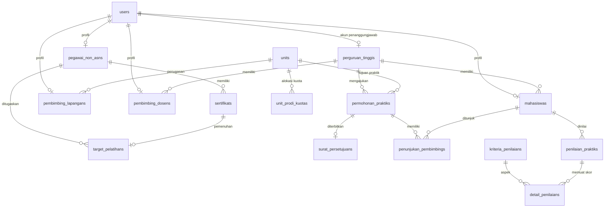

# MANDALA (Manajemen Diklat Akademik & Layanan Administrasi)

**MANDALA** adalah sistem informasi manajemen terintegrasi untuk tata kelola pendidikan dan pelatihan (**Diklat**), kegiatan akademik & penelitian (**Diklit**), pengelolaan kuota unit/instalasi rumah sakit, nota kesepahaman (MoU) perguruan tinggi mitra, perizinan praktik klinik mahasiswa, serta evaluasi kompetensi klinis di lingkungan rumah sakit.

---

## 1. Fitur & Modul Sistem

### A. Modul Diklat (Pelatihan Pegawai & Peserta Diklat)

- **Target Pelatihan:** Penugasan dan pemantauan target pelatihan wajib / fungsional tenaga kesehatan dan staf pegawai / peserta diklat.
- **Upload & Berkas Sertifikat:** Pengunggahan mandiri sertifikat pelatihan (PDF/JPG/PNG max 5MB) dengan penautan otomatis ke target pelatihan.
- **Verifikasi Sertifikat:** Antrean verifikasi keabsahan dokumen oleh Admin Diklat RS dengan review berkas & form keputusan (_Setujui/Tolak_).

### B. Modul Diklit (Booking Unit RS & Praktik Mahasiswa)

- **Manajemen Perguruan Tinggi & MoU:**
  - Pencatatan data institusi mitra dan _gatekeeper_ masa berlaku MoU dengan pengecekan kedaluwarsa otomatis (_auto-expiry check_).
  - **Otomatisasi Akun Admin PT:** Pembuatan akun login instan otomatis (`[nama PT]@mandala.test` / `password`) saat penambahan data MoU baru.
- **Unit RS & Alokasi Kuota:** Konfigurasi unit ruangan (IGD, ICU, Bedah, Farmasi, Lab, dsb.) dengan mode kuota **Gabungan** atau **Per-Program Studi**.
- **Kalender Booking & Permohonan Praktik:**
  - Pengajuan izin praktik oleh Admin PT dengan _real-time quota check_ dan pencegahan tabrakan jadwal (_overlap collision_).
  - Tampilan fleksibel berbasis tab: **Daftar Permohonan** dan **Matriks Keterisian Unit Bulanan**.
  - **Review & Persetujuan Surat Izin Terintegrasi:** Proses review berkas, penolakan, serta penerbitan nomor surat izin resmi rumah sakit dilakukan langsung di dalam modal detail permohonan booking.
- **Penunjukan Pembimbing:** Penetapan _Clinical Instructor_ (CI) Lapangan RS dan Dosen Pembimbing Institusi per mahasiswa.
- **Penilaian Praktik Mahasiswa:** Evaluasi kompetensi klinis dinamis berbasis kriteria penilaian terbobot (skor otomatis 0–100).
- **Master Kriteria Evaluasi:** Pengaturan aspek kompetensi dan persentase pembobotan penilaian (total 100%).

### C. Modul Manajemen Pengguna, Role & Hak Akses (Laravel Spatie)

- **Manajemen Role & Permissions (Eksklusif Super Admin):** Konfigurasi hak akses berbasis engine _Spatie Laravel Permission_. Super Admin dapat membuat peran baru, menambah izin (_permissions_), serta mencentang matriks izin per peran dengan tombol preset template instan.
- **Kelola Akun Multi-Peran (Super Admin & Admin Diklat):** Penambahan dan pembaruan akun pengguna dengan form ekstensi profil dinamis (Pegawai/Peserta Diklat, Mahasiswa, CI Lapangan, Dosen Pembimbing, Admin PT, Admin Diklat, Super Admin).
- **Kelola Akun Mahasiswa Mandiri (Admin Perguruan Tinggi):** Dengan izin khusus `kelola-akun-mahasiswa`, Admin PT dapat mengelola data akun mahasiswa dari institusinya sendiri secara aman tanpa dapat mengakses data institusi lain.

---

## 2. Hak Akses & Peran Pengguna (RBAC)

| Peran (Role)                    | Kode Role             | Hak Akses Utama                                                                                                     |
| :------------------------------ | :-------------------- | :------------------------------------------------------------------------------------------------------------------ |
| **Super Administrator**         | `super_admin`         | Akses penuh sistem, termasuk manajemen Role & Permissions Spatie (`/pengguna/role`)                                 |
| **Admin Diklat RS**             | `admin_diklat`        | Kelola akun global, target pelatihan, verifikasi sertifikat, review & persetujuan booking, unit RS & kriteria nilai |
| **Admin Perguruan Tinggi**      | `admin_pt`            | Cek kuota, ajukan booking praktik, dan kelola akun mahasiswa institusi sendiri                                      |
| **Peserta Diklat / Pegawai**    | `pegawai_non_asn`     | Pantau target kompetensi tahunan & unggah berkas sertifikat                                                         |
| **Pembimbing Lapangan (CI RS)** | `pembimbing_lapangan` | Bimbing mahasiswa di unit RS & input penilaian kompetensi klinis                                                    |
| **Pembimbing Dosen (PT)**       | `pembimbing_dosen`    | Pantau mahasiswa bimbingan & input penilaian akademik institusi                                                     |
| **Mahasiswa Praktikan**         | `mahasiswa`           | Pantau jadwal stase praktik, pembimbing, dan status permohonan stase                                                |

---

## 3. Tech Stack

- **Backend Framework:** [Laravel 13](https://laravel.com) (PHP 8.3+)
- **Frontend Reaktif:** [Livewire 4](https://livewire.laravel.com) (Single-File Components)
- **UI Toolkit:** [Flux UI Pro](https://fluxui.dev) (dengan `<flux:date-picker>` terpadu)
- **Styling:** [Tailwind CSS v4](https://tailwindcss.com) + `@tailwindcss/vite`
- **Aset Vektor:** Logo & Favicon resmi `mandala.svg`
- **Database:** MySQL 8.x
- **Keamanan:** RBAC Middleware (`CheckRole`), Spatie Permission, Laravel Fortify, WebAuthn Passkeys, 2FA TOTP

---

## 4. Skema Database & Relasi (ERD)



---

## 5. Akun Uji Coba Default (Seeder)

Semua akun default menggunakan password: `password`

| Peran                           | Email Login                                              |
| :------------------------------ | :------------------------------------------------------- |
| **Super Admin**                 | `superadmin@mandala.test`                                |
| **Admin Diklat RS**             | `admin@mandala.test`                                     |
| **Admin Perguruan Tinggi**      | `adminpt@mandala.test` _(atau `[nama PT]@mandala.test`)_ |
| **Peserta Diklat 1 (Dokter)**   | `andika@mandala.test`                                    |
| **Peserta Diklat 2 (Farmasi)**  | `siti@mandala.test`                                      |
| **Pembimbing Lapangan (CI RS)** | `ci.lapangan@mandala.test`                               |
| **Pembimbing Dosen (PT)**       | `dosen@mandala.test`                                     |
| **Mahasiswa Praktikan**         | `mahasiswa@mandala.test`                                 |

---

## 6. Panduan Instalasi & Menjalankan

```bash
# 1. Konfigurasi Environment & DB MySQL
cp .env.example .env
php artisan key:generate

# 2. Migrasi Database & Seeder Data Uji Coba
php artisan migrate:fresh --seed

# 3. Build Asset Frontend
npm run build

# 4. Jalankan Aplikasi
composer run dev
```

---

## 7. Dokumentasi Terkait

- [Panduan Penggunaan & Struktur Sistem MANDALA](file:///Applications/MAMP/htdocs/mandala/PANDUAN_PENGGUNAAN_DAN_STRUKTUR_MANDALA.md)
- [Catatan Pembelajaran & Status Pengembangan Harian](file:///Applications/MAMP/htdocs/mandala/CATATAN_PENGEMBANGAN_HARIAN.md)
- [Spesifikasi Teknis & Logika Bisnis RS](file:///Applications/MAMP/htdocs/mandala/spesifikasi_teknis_laravel_manajemen_diklat_rs.md)

---

## 8. Lisensi & Pengembang

Dikembangkan oleh **[Zetware](https://zetware.id)** © 2026. Hak cipta dilindungi undang-undang.
